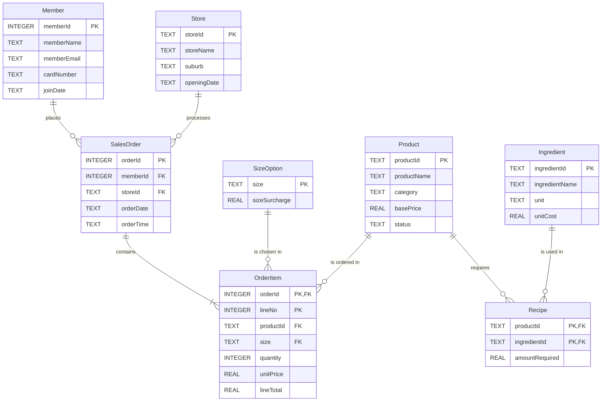

# Bubble Trouble — CITS1402 Project (Semester 2, 2026)

A SQLite database for a multi-store bubble-tea business: members, stores, products, cup sizes,
orders, recipes, historical prices and a "every 10th drink is free" loyalty program.

This README explains **every file, every block and every line**, and answers the **"why"**
behind each choice (why CASCADE, why GLOB, what GLOB is, and so on), so we can present and
defend the project in the demonstration.

---

## Contents

1. [What is in this repository](#1-what-is-in-this-repository)
2. [How to run everything](#2-how-to-run-everything)
3. [What we changed from the first version, and why](#3-what-we-changed-from-the-first-version-and-why)
4. [Mission 1 — ER model (design.pdf)](#4-mission-1--er-model-designpdf)
5. [Missions 2 & 3 — createTables.sql, line by line](#5-missions-2--3--createtablessql-line-by-line)
6. [Mission 4 — createTriggers.sql, line by line](#6-mission-4--createtriggerssql-line-by-line)
7. [Mission 5 — createViews.sql, line by line](#7-mission-5--createviewssql-line-by-line)
8. [Mission 6 — queries.sql, query by query](#8-mission-6--queriessql-query-by-query)
9. [Testing — testData.sql and testEvidence.txt](#9-testing--testdatasql-and-testevidencetxt)
10. [Decisions where the spec could be read two ways](#10-decisions-where-the-spec-could-be-read-two-ways)
11. [Mission 7 — demonstration prep](#11-mission-7--demonstration-prep)
12. [Glossary](#12-glossary)
13. [Before submitting — checklist](#13-before-submitting--checklist)

---

## 1. What is in this repository

| File | Mission | What it does | In the ZIP? |
|---|---|---|---|
| `design.pdf` | 1 | ER diagram + design commentary (362 words, limit 400) | **Yes** |
| `createTables.sql` | 2 + 3 | Creates the 8 tables, keys, foreign keys and business-rule CHECKs | **Yes** |
| `createTriggers.sql` | 4 | Trigger A (auto price) and Trigger B (loyalty reward) | **Yes** |
| `createViews.sql` | 5 | Views `MonthlySales` and `MemberSummary` | **Yes** |
| `queries.sql` | 6 | The 8 business queries (Q1–Q8) inside the provided skeleton | **Yes** |
| `testEvidence.txt` | Detective | Our 5 required tests: prediction vs actual result | **Yes** |
| `testData.sql` | — | Our small, hand-checkable sample data for testing and the demo | No |
| `docs/design.html` | — | Editable source of the ER diagram in `design.pdf` (diagram only; the commentary is in the PDF) | No |
| `README.md` | — | This explanation | No |

---

## 2. How to run everything

```bash
# 1. Build a fresh database (order matters: tables -> triggers -> views -> data)
rm -f BubbleTrouble.db
sqlite3 BubbleTrouble.db ".read createTables.sql" ".read createTriggers.sql" \
                         ".read createViews.sql"  ".read testData.sql"

# 2. Run the business queries (this is the command the skeleton recommends)
sqlite3 BubbleTrouble.db < queries.sql

# 3. Poke around by hand
sqlite3 BubbleTrouble.db
sqlite> PRAGMA foreign_keys = ON;      -- switch FK checking on for this session
sqlite> .headers on
sqlite> .mode column
sqlite> SELECT * FROM MemberSummary;
```

Why this order? Triggers and views refer to tables, so tables must exist first. Data goes in
**after** the triggers exist, so that every inserted `OrderItem` gets its price and loyalty
calculated automatically.

---

## 3. What we changed from the first version, and why

The first version of `createTables.sql` and `createTriggers.sql` was already well structured.
We kept that structure and fixed these problems, each one **found by running a test**:

| # | Problem in the first version | Proof | Fix |
|---|---|---|---|
| 1 | `storeId`, `productId`, `size`, `ingredientId` accepted **NULL** as a primary key | `INSERT INTO Store VALUES (NULL, ...)` succeeded | Added `NOT NULL` to each TEXT primary key |
| 2 | `basePrice = 'abc'` was **accepted** | In SQLite, text is always "greater" than any number, so `'abc' > 0` is TRUE | Added `typeof(basePrice) IN ('integer','real')` (same for `amountRequired`) |
| 3 | `quantity = 2.5` was **accepted**, even though BR3 says "integer" | `2.5 BETWEEN 1 AND 10` is TRUE | Added `typeof(quantity) = 'integer'` |
| 4 | Because of #3, the loyalty maths broke: with 2.5 drinks the next line was wrongly made free | `2.5/10 = 0.25 < 4.5/10 = 0.45` (decimal division, not whole-number division) | Fixed by #3: quantities are always integers, so `/ 10` is always whole-number division |
| 5 | Trigger B only worked if Trigger A happened to run **first** | Swapping the creation order made every `lineTotal` NULL | Trigger B now works out the price itself (`COALESCE(NEW.unitPrice, basePrice + sizeSurcharge)`), so the firing order no longer matters |
| 6 | CHECK constraints had no names | Error said only "CHECK constraint failed" | Named them `BR1_validPrice` … `BR5_cardChecksum`, matching the spec's rule numbers |

New files added: `createViews.sql`, `queries.sql` (filled in), `design.pdf`, `testEvidence.txt`,
`testData.sql`, `README.md`.

---

## 4. Mission 1 — ER model (design.pdf)

The full diagram (crow's-foot notation with min..max on every line) is in **`design.pdf`**.
Here is the same model as a quick diagram (GitHub draws it automatically):



### How to read the crow's-foot symbols

| Symbol | Meaning | Example |
|---|---|---|
| `\|\|` (two bars) | exactly one (min 1, max 1) | each order has exactly one member |
| `o{` (circle + crow's foot) | zero or many (min 0, max N) | a member may have 0 orders (just joined) |
| `\|{` (bar + crow's foot) | one or many (min 1, max N) | an order contains at least one drink |

The symbol **next to the box** is the maximum; the one **further away** is the minimum.

### Every relationship, and why it has that cardinality

| Relationship | Left side | Right side | Why |
|---|---|---|---|
| Member **places** SalesOrder | 1..1 | 0..N | Spec: "every recorded sales order belongs to a registered member" (so exactly 1). A new member has no orders yet (so 0 allowed). |
| Store **processes** SalesOrder | 1..1 | 0..N | "Each sales order is processed at exactly one store." A new store has no orders (Q3 must still show it). |
| SalesOrder **contains** OrderItem | 1..1 | 1..N | A transaction with no drinks is not a sale, so at least 1 line. Each line belongs to exactly 1 order. |
| SizeOption **is chosen in** OrderItem | 1..1 | 0..N | Each line has exactly 1 size; a size might not have been sold yet. |
| Product **is ordered in** OrderItem | 1..1 | 0..N | Each line is exactly 1 product; a product may never be ordered (Q5 looks for these). |
| Product **requires** Recipe | 1..1 | 0..N | A recipe row belongs to exactly 1 product; a product's recipe might not be entered yet. |
| Ingredient **is used in** Recipe | 1..1 | 0..N | A recipe row uses exactly 1 ingredient; an ingredient may be in no recipe (Q2 must show it). |

> Note: "an order has **at least one** line" is a business rule shown on the ERD. The database
> cannot enforce a minimum of 1 with a foreign key (the order row must be inserted *before* its
> lines). All other cardinalities are enforced by `NOT NULL` + `FOREIGN KEY`.

### Two special entities

- **OrderItem is a *weak entity*** (double border in the PDF). It cannot be identified on its
  own. "Line 1" means nothing until you say *which order*. So its key borrows the parent's key:
  `(orderId, lineNo)`.
- **Recipe is an *associative entity*** (green in the PDF). Product ↔ Ingredient is
  many-to-many, and a relational database cannot store M:N directly. So we put a table in the
  middle. That turns one M:N into two 1:N relationships, and gives `amountRequired` a home
  (it describes the *pair*, e.g. "Pearl Milk Tea needs 50 g of Tapioca Pearl").

### The four commentary questions (short versions; full answers are in design.pdf)

1. **Why is OrderItem separate from SalesOrder?** One order = one transaction (member, store,
   date, time). But it can hold several different drinks. Putting drinks in SalesOrder would need
   `drink1, drink2, …` columns or would repeat member/store/date on every drink row. That is
   redundancy, and it causes update anomalies. Two tables = 1:N.
2. **Why is OrderItem's key composite?** `lineNo` restarts at 1 in every order. `orderId` alone
   repeats (many lines per order) and `lineNo` alone repeats (across orders). Only the pair
   `(orderId, lineNo)` is unique.
3. **Why is Recipe needed?** Product–Ingredient is M:N. A list like "tea, milk, pearls" inside
   Product breaks 1NF. It cannot be checked by a foreign key and has nowhere to store the amount.
   Recipe holds one row per pair, with its amount.
4. **Why store `unitPrice` in OrderItem?** The price calculated from Product + SizeOption is
   *today's* price. If the menu changes, yesterday's sale must not change. So we store the price
   that applied at the moment of sale. This is deliberate historical data, not accidental
   redundancy.

---

## 5. Missions 2 & 3 — createTables.sql, line by line

### 5.1 The header

```sql
PRAGMA foreign_keys = ON;
```
- **What:** `PRAGMA` is a SQLite-specific command that changes a database setting.
- **Why:** SQLite **does not check foreign keys unless you switch this on**. It is off by default,
  and it is set per connection (per `sqlite3` session). Without it, every `FOREIGN KEY` clause
  below is ignored and orphan rows could be inserted. The spec says: "Enable and test
  foreign-key enforcement."

```sql
DROP TABLE IF EXISTS Recipe;
DROP TABLE IF EXISTS OrderItem;
DROP TABLE IF EXISTS SalesOrder;
DROP TABLE IF EXISTS Ingredient;
DROP TABLE IF EXISTS SizeOption;
DROP TABLE IF EXISTS Product;
DROP TABLE IF EXISTS Member;
DROP TABLE IF EXISTS Store;
```
- **What:** removes old copies of the tables.
- **Why `IF EXISTS`:** on a brand-new database the tables do not exist yet. Without `IF EXISTS`
  the script would stop with an error. With it, the script runs on a clean database *and* can be
  re-run.
- **Why this order (children first):** with foreign keys on, dropping a *parent* (e.g. `Store`)
  while a *child* (`SalesOrder`) still points to it can raise a foreign-key error. So we drop the
  tables that point at others first (`Recipe`, `OrderItem`, `SalesOrder`), then the tables they
  point at.

### 5.2 Store

```sql
CREATE TABLE Store (
    storeId     TEXT NOT NULL PRIMARY KEY,
    storeName   TEXT NOT NULL,
    suburb      TEXT NOT NULL,
    openingDate TEXT NOT NULL
);
```
| Line | Meaning | Why |
|---|---|---|
| `storeId TEXT NOT NULL PRIMARY KEY` | unique store code, e.g. `'S01'` | The spec requires `TEXT`. `PRIMARY KEY` = unique + used by foreign keys. **`NOT NULL` is needed because of a SQLite quirk:** a non-INTEGER primary key *allows NULL* unless you say `NOT NULL` (we proved this by inserting a NULL store). |
| `storeName TEXT NOT NULL` | name | Every store has a name (spec 3.1). |
| `suburb TEXT NOT NULL` | suburb | Every store has a suburb. |
| `openingDate TEXT NOT NULL` | e.g. `'2026-09-01'` | SQLite has **no DATE type**. Dates are stored as ISO text `YYYY-MM-DD`, which sorts in date order and works with date functions like `strftime`. |

### 5.3 Member (and BR5 — the card checksum)

```sql
CREATE TABLE Member (
    memberId    INTEGER PRIMARY KEY,
    memberName  TEXT NOT NULL,
    memberEmail TEXT NOT NULL,
    cardNumber  TEXT NOT NULL,
    joinDate    TEXT NOT NULL,
```
- `memberId INTEGER PRIMARY KEY`: in SQLite, a column declared exactly `INTEGER PRIMARY KEY`
  becomes the table's internal **rowid**. It can never be NULL (if you insert NULL, SQLite picks
  the next number), so no extra `NOT NULL` is needed.
- `cardNumber TEXT`: why **TEXT and not INTEGER**? A card number is an *identifier*, not a
  quantity. We never add or multiply card numbers, and it can start with `0` (our test member
  Alice has `0830166130`). An INTEGER would silently drop the leading zero.

```sql
    CONSTRAINT BR5_cardChecksum CHECK (
        length(cardNumber) = 10
        AND cardNumber GLOB '[0-9][0-9][0-9][0-9][0-9][0-9][0-9][0-9][0-9][0-9]'
        AND (
              10*CAST(substr(cardNumber,1,1)  AS INTEGER)
            +  9*CAST(substr(cardNumber,2,1)  AS INTEGER)
            ...
            +  1*CAST(substr(cardNumber,10,1) AS INTEGER)
        ) % 11 = 0
    )
);
```

**`CONSTRAINT BR5_cardChecksum CHECK ( ... )`**
- `CHECK (condition)`: SQLite tests the condition on every INSERT and UPDATE. If it is **false**,
  the row is rejected.
- `CONSTRAINT BR5_cardChecksum`: gives the rule a **name**, so the error message says
  `CHECK constraint failed: BR5_cardChecksum`. That makes it obvious which business rule stopped
  the row.

**Part 1: `length(cardNumber) = 10`**. Rejects wrong-length strings like `'526457946'` (9) or
`'52645794660'` (11). (The GLOB below also forces 10 characters, so this is a readable,
belt-and-braces check.)

**Part 2: `cardNumber GLOB '[0-9]...[0-9]'` (ten times). What is GLOB?**
- `GLOB` is SQLite's **pattern-matching operator**. It uses the same wildcards as file names in
  a Unix terminal (like `ls *.sql`):

  | Pattern piece | Matches |
  |---|---|
  | `*` | any number of characters (including none) |
  | `?` | exactly one character (any) |
  | `[0-9]` | exactly one character in the range 0–9, i.e. **one digit** |
  | `[abc]` | exactly one of a, b or c |
  | `[^0-9]` | exactly one character that is **not** a digit |

- The pattern must match the **whole** string. It is also **case-sensitive**.
- Our pattern is `[0-9]` written 10 times, which means "exactly 10 characters, and every one is a
  digit". So it rejects `'52645794a6'` (a letter), `' 264579466'` (a space), `'5264579466.0'`
  (a dot) and so on.

**Why GLOB and not something else?**
| Alternative | Why we did not use it |
|---|---|
| `LIKE` | `LIKE` only has `%` (anything) and `_` (one character). It has **no way to say "a digit"**, so `LIKE '__________'` would accept `'abcdefghij'`. |
| `CAST(cardNumber AS INTEGER)` | `CAST` never fails. `CAST('12ab567890' AS INTEGER)` quietly returns `12`. This is exactly the spec's warning: "Do not assume that a value is valid merely because it looks numeric." |
| `REGEXP` | Not built into SQLite; using it gives `no such function: REGEXP`. |
| `NOT GLOB '*[^0-9]*'` | Also correct ("no non-digit anywhere"), combined with the length check. Ours is easier to read aloud. |

**Part 3: the weighted sum `% 11 = 0`**
- `substr(cardNumber, 3, 1)`: take **1 character starting at position 3** (SQLite counts from 1).
  So this is digit d3.
- `CAST(... AS INTEGER)`: turn the character `'6'` into the number `6` so we can multiply it.
- `10*d1 + 9*d2 + ... + 1*d10`: the weights from the spec.
- `% 11`: the **modulo** (remainder) operator. `% 11 = 0` means "divisible by 11".
- **Why the order of the three parts matters:** `AND` stops at the first false part. So if the
  string is not 10 digits, we never try to do arithmetic on letters.

Worked example with the spec's valid card `5264579466`:

| digit | 5 | 2 | 6 | 4 | 5 | 7 | 9 | 4 | 6 | 6 |
|---|---|---|---|---|---|---|---|---|---|---|
| weight | 10 | 9 | 8 | 7 | 6 | 5 | 4 | 3 | 2 | 1 |
| product | 50 | 18 | 48 | 28 | 30 | 35 | 36 | 12 | 12 | 6 |

Sum = 275 = 25 × 11 → remainder 0 → **accepted**. Change the last digit to 7 → sum 276 →
remainder 1 → **rejected** (this is Test 1 in `testEvidence.txt`).

### 5.4 Product (BR1 and BR2)

```sql
CREATE TABLE Product (
    productId   TEXT NOT NULL PRIMARY KEY,
    productName TEXT NOT NULL,
    category    TEXT NOT NULL,
    basePrice   REAL NOT NULL,
    status      TEXT NOT NULL,
    CONSTRAINT BR1_validPrice  CHECK (typeof(basePrice) IN ('integer','real') AND basePrice > 0),
    CONSTRAINT BR2_validStatus CHECK (status IN ('ACTIVE','DISCONTINUED'))
);
```
- **BR1: `basePrice > 0`**: *strictly* greater than zero, so `0` is rejected and `0.01` accepted.
- **Why also `typeof(basePrice) IN ('integer','real')`?**
  - SQLite is loosely typed. A `REAL` column will still *store text* if the text cannot be
    turned into a number, e.g. `'abc'`.
  - SQLite's sort order is `NULL < numbers < text`. So **`'abc' > 0` is TRUE**, and without
    `typeof` the price `'abc'` would pass BR1. We tested this, and it did.
  - `typeof(x)` returns the stored type: `'integer'`, `'real'`, `'text'`, `'blob'` or `'null'`.
    Valid inputs like `5`, `5.5` or even `'5.5'` are converted to a number first, so they still
    pass.
- **BR2: `status IN ('ACTIVE','DISCONTINUED')`**: only these two exact strings. `IN` is
  **case-sensitive** here, so `'active'` is rejected.
- **Why keep discontinued products at all?** Old order lines and recipes still point to them.
  Deleting them would destroy history (see RESTRICT below).

### 5.5 SizeOption and Ingredient

```sql
CREATE TABLE SizeOption (
    size          TEXT NOT NULL PRIMARY KEY,
    sizeSurcharge REAL NOT NULL
);

CREATE TABLE Ingredient (
    ingredientId   TEXT NOT NULL PRIMARY KEY,
    ingredientName TEXT NOT NULL,
    unit           TEXT NOT NULL,
    unitCost       REAL NOT NULL
);
```
Simple "lookup" tables. Each has a single-column primary key, with `NOT NULL` for the same
SQLite-quirk reason as Store. `size` is the short unique code the spec describes (3.4).

### 5.6 SalesOrder — foreign keys with RESTRICT

```sql
CREATE TABLE SalesOrder (
    orderId   INTEGER PRIMARY KEY,
    memberId  INTEGER NOT NULL,
    storeId   TEXT NOT NULL,
    orderDate TEXT NOT NULL,
    orderTime TEXT NOT NULL,
    FOREIGN KEY (memberId) REFERENCES Member(memberId)
        ON DELETE RESTRICT,
    FOREIGN KEY (storeId) REFERENCES Store(storeId)
        ON DELETE RESTRICT
);
```
- `FOREIGN KEY (memberId) REFERENCES Member(memberId)`: every `memberId` here **must already
  exist** in `Member`. This gives "an order cannot refer to a member that does not exist" (tested
  in Test 2).
- `memberId ... NOT NULL`: every order must have a member (a FK alone would still allow NULL).
- **`ON DELETE RESTRICT`**: if someone tries to delete a member (or store) that still has orders,
  SQLite **refuses** with `FOREIGN KEY constraint failed`.
- **Why RESTRICT here?** The spec says "deleting a member/store must **not silently delete**
  historical orders."

**All the referential actions, and why we did or did not pick each one:**

| Action | What happens to the child rows when the parent is deleted | Used? |
|---|---|---|
| `CASCADE` | child rows are **deleted too**, automatically | Only `OrderItem → SalesOrder` |
| `RESTRICT` | the delete is **refused immediately** | Member, Store, Product, SizeOption, Ingredient |
| `NO ACTION` (the default) | also refused, but checked at the end of the statement | Not needed |
| `SET NULL` | the child's FK column becomes NULL | No. `memberId`/`storeId` are `NOT NULL` (every order *must* have a member and store), and "who bought it" would be lost |
| `SET DEFAULT` | the child's FK column becomes its default | No, same reason |

**Why not CASCADE for Member → SalesOrder?** Deleting one member would silently delete all their
orders, and then (through the next cascade) all their order lines. That removes revenue history,
which is exactly what the spec forbids.

### 5.7 OrderItem — composite key, BR3, CASCADE

```sql
CREATE TABLE OrderItem (
    orderId   INTEGER NOT NULL,
    lineNo    INTEGER NOT NULL,
    productId TEXT NOT NULL,
    size      TEXT NOT NULL,
    quantity  INTEGER NOT NULL,
    unitPrice REAL,
    lineTotal REAL,
    CONSTRAINT BR3_validQuantity CHECK (typeof(quantity) = 'integer' AND quantity BETWEEN 1 AND 10),
    PRIMARY KEY (orderId, lineNo),
    FOREIGN KEY (orderId) REFERENCES SalesOrder(orderId)
        ON DELETE CASCADE,
    FOREIGN KEY (productId) REFERENCES Product(productId)
        ON DELETE RESTRICT,
    FOREIGN KEY (size) REFERENCES SizeOption(size)
        ON DELETE RESTRICT
);
```
| Line | Why |
|---|---|
| `unitPrice REAL` / `lineTotal REAL` with **no** `NOT NULL` | They must be allowed to arrive as NULL, because that is the signal for the triggers to calculate them. |
| `BR3: typeof(quantity) = 'integer'` | The spec says "an **integer** from 1 to 10". Without this, `2.5` passes (`2.5 BETWEEN 1 AND 10` is true). It also keeps the loyalty trigger's `/ 10` as whole-number division (see Section 3, row 4). `'3'` as text is still fine: the INTEGER column converts it to `3` first. |
| `quantity BETWEEN 1 AND 10` | `BETWEEN` is **inclusive**: 1 and 10 are allowed, 0 and 11 are rejected. |
| `PRIMARY KEY (orderId, lineNo)` | **Composite key.** `lineNo` restarts in every order, so neither column alone is unique; the pair is. It also stops the same line being entered twice (`UNIQUE constraint failed`). |
| `orderId ... ON DELETE CASCADE` | Spec: "deleting a SalesOrder should automatically delete its OrderItem rows." Lines have no meaning without their order (weak entity), so they go with it. We tested it: order 1007 had 3 lines, and after `DELETE FROM SalesOrder WHERE orderId = 1007` it had 0. |
| `productId ... ON DELETE RESTRICT` | Spec: "historical products should normally be **discontinued rather than deleted**." RESTRICT makes deleting a sold product impossible, so staff must set `status = 'DISCONTINUED'` instead. |
| `size ... ON DELETE RESTRICT` | Same idea: a size used in past sales cannot vanish. |

### 5.8 Recipe — the associative table (BR4)

```sql
CREATE TABLE Recipe (
    productId      TEXT NOT NULL,
    ingredientId   TEXT NOT NULL,
    amountRequired REAL NOT NULL,
    CONSTRAINT BR4_validAmount CHECK (typeof(amountRequired) IN ('integer','real') AND amountRequired > 0),
    PRIMARY KEY (productId, ingredientId),
    FOREIGN KEY (productId) REFERENCES Product(productId)
        ON DELETE RESTRICT,
    FOREIGN KEY (ingredientId) REFERENCES Ingredient(ingredientId)
        ON DELETE RESTRICT
);
```
- **BR4:** `amountRequired > 0`, strictly (0 and negative amounts rejected). Same `typeof` guard
  as BR1.
- **`PRIMARY KEY (productId, ingredientId)`:** one row per (drink, ingredient) pair. It stops
  "Fresh Milk" being listed twice for Pearl Milk Tea.
- **Foreign keys:** "a recipe cannot refer to a product or ingredient that does not exist."
- **Why RESTRICT and not CASCADE?** Discontinued products keep their recipes (spec 3.3), and an
  ingredient that is still in a recipe should not disappear silently. (CASCADE on
  `Recipe.productId` would also be defensible, since a recipe belongs to its product. We chose
  the safer option.)

### 5.9 Things we deliberately did NOT add

- **No UNIQUE on `cardNumber` or `memberEmail`.** The spec only says the *identifier* is unique,
  and extra rules could reject valid hidden test data. (Adding `UNIQUE` is a likely "micro-change"
  question: just write `cardNumber TEXT NOT NULL UNIQUE`.)
- **No extra columns or tables.** The spec says not to add any.
- **No INSERT statements** in the submission files. The spec forbids them.

---

## 6. Mission 4 — createTriggers.sql, line by line

### 6.1 What is a trigger?

A **trigger** is SQL that the database runs **automatically** when something happens to a table
(INSERT, UPDATE or DELETE). Here: every time a row is inserted into `OrderItem`, we want the
database itself to fill in the price and apply the loyalty reward. The clerk (or the marker's test
script) cannot forget to do it.

Key words used below:
- `AFTER INSERT ON OrderItem`: run **after** a new row has been added to OrderItem.
- `NEW`: the row that was just inserted. `NEW.quantity` is its quantity, and so on.
- `WHEN condition`: only run the trigger if the condition is true.
- SQLite triggers always run once **for each row** inserted.

**Why AFTER and not BEFORE?** In SQLite you **cannot change `NEW` values** inside a trigger (no
`SET NEW.unitPrice = ...`). The only way to fill in a column is to `UPDATE` the row after it
exists. In a BEFORE trigger the row does not exist yet, so there is nothing to update. AFTER is
the right choice.

```sql
PRAGMA foreign_keys = ON;
DROP TRIGGER IF EXISTS trg_orderitem_price;
DROP TRIGGER IF EXISTS trg_orderitem_loyalty;
```
Same idea as the tables: switch FKs on for this connection, and remove old versions so the script
can be re-run.

### 6.2 Trigger A — automatic historical pricing

```sql
CREATE TRIGGER trg_orderitem_price
AFTER INSERT ON OrderItem
WHEN NEW.unitPrice IS NULL
BEGIN
    UPDATE OrderItem
    SET unitPrice = (
        SELECT p.basePrice + s.sizeSurcharge
        FROM Product p, SizeOption s
        WHERE p.productId = NEW.productId
          AND s.size = NEW.size
    )
    WHERE orderId = NEW.orderId AND lineNo = NEW.lineNo;
END;
```
| Line | Meaning / why |
|---|---|
| `CREATE TRIGGER trg_orderitem_price` | Name of the trigger (`trg_` prefix = trigger, easy to recognise). |
| `AFTER INSERT ON OrderItem` | Fires after each new order line. |
| `WHEN NEW.unitPrice IS NULL` | **Only** when no price was supplied. If a price *was* supplied (e.g. imported historical data), the trigger does not run, so it **never overwrites** it (spec 8.1). Note `IS NULL`, not `= NULL`: `= NULL` is never true in SQL. |
| `UPDATE OrderItem SET unitPrice = (...)` | Put the calculated price into the row. |
| `SELECT p.basePrice + s.sizeSurcharge` | Spec formula: unitPrice = basePrice + sizeSurcharge. |
| `FROM Product p, SizeOption s` | `p` and `s` are short aliases. The comma means "combine rows from both tables"; the WHERE then picks exactly one product and one size. |
| `WHERE p.productId = NEW.productId AND s.size = NEW.size` | The product and size **of the new line**. |
| `WHERE orderId = NEW.orderId AND lineNo = NEW.lineNo` | Update **only the new row**. `(orderId, lineNo)` is the primary key, so this matches exactly one row. **Older rows are never recalculated**, so a menu price change cannot alter past sales. |

**Historical pricing in action (from testData.sql):** order 1001 sold a Large Pearl Milk Tea at
`7.00`. Later, `UPDATE Product SET basePrice = 6.50 WHERE productId = 'P01'` changed the menu.
Order 1001 still shows `7.00`, and only new lines use the new price.

### 6.3 Trigger B — Bubble Rewards (every 10th drink free)

```sql
CREATE TRIGGER trg_orderitem_loyalty
AFTER INSERT ON OrderItem
WHEN NEW.lineTotal IS NULL
BEGIN
    UPDATE OrderItem
    SET lineTotal = (
        SELECT
            CASE
                WHEN (prior.priorQty / 10) < ((prior.priorQty + NEW.quantity) / 10)
                    THEN (NEW.quantity - 1) * price.unitPrice
                ELSE NEW.quantity * price.unitPrice
            END
        FROM
            (SELECT COALESCE(SUM(oi2.quantity), 0) AS priorQty
             FROM OrderItem oi2
             JOIN SalesOrder so2 ON oi2.orderId = so2.orderId
             WHERE so2.memberId = (SELECT memberId FROM SalesOrder WHERE orderId = NEW.orderId)
               AND NOT (oi2.orderId = NEW.orderId AND oi2.lineNo = NEW.lineNo)
            ) AS prior,
            (SELECT COALESCE(NEW.unitPrice, p.basePrice + s.sizeSurcharge) AS unitPrice
             FROM Product p, SizeOption s
             WHERE p.productId = NEW.productId
               AND s.size = NEW.size
            ) AS price
    )
    WHERE orderId = NEW.orderId AND lineNo = NEW.lineNo;
END;
```

Read it from the **inside out**. It builds two one-row helper tables, `prior` and `price`, and
then uses them in a `CASE`.

**Helper 1: `prior` — how many drinks did this member buy before this line?**

| Line | Meaning / why |
|---|---|
| `SELECT COALESCE(SUM(oi2.quantity), 0) AS priorQty` | Add up the quantities of the member's earlier lines. We sum **quantity**, not rows, because one line can be several drinks. Free drinks are counted too, since "a free drink still counts toward future rewards". |
| `COALESCE(..., 0)` | For a member's very first purchase there are no earlier rows, so `SUM` gives **NULL**. `COALESCE` swaps NULL for 0. Without it, `NULL / 10` is NULL, the `WHEN` test is never true, and a first order of 10 drinks would not get its free drink. |
| `FROM OrderItem oi2 JOIN SalesOrder so2 ON oi2.orderId = so2.orderId` | OrderItem does not store the member (that would be redundant), so we join to SalesOrder to find whose order each line belongs to. `oi2`/`so2` are aliases, so they don't clash with `NEW`. |
| `WHERE so2.memberId = (SELECT memberId FROM SalesOrder WHERE orderId = NEW.orderId)` | A small subquery finds **the member who placed the new line's order**, and we keep only that member's lines. There is no store filter, because loyalty counts **across all stores**. |
| `AND NOT (oi2.orderId = NEW.orderId AND oi2.lineNo = NEW.lineNo)` | **Exclude the new line itself.** Because this is an AFTER trigger, the new row is already in the table; if we did not exclude it, we would count it as a "previous" drink. |
| `) AS prior` | Name this one-row result `prior`. |

Why can we count "everything already in the table" as *before*? Because the spec promises that
orders are inserted in date order, lines in increasing `lineNo`, and lines are never deleted.

**Helper 2: `price` — what is one drink on this line worth?**

| Line | Meaning / why |
|---|---|
| `COALESCE(NEW.unitPrice, p.basePrice + s.sizeSurcharge)` | If the insert **supplied** a price, use it. Otherwise use the current menu price, the same formula as Trigger A. `COALESCE(a, b)` means "a, unless a is NULL, then b". |
| Why not just read the price Trigger A wrote? | Both triggers fire on the same INSERT, and **SQLite does not promise which runs first**. If B ran first, the price would still be NULL and `lineTotal` would become NULL (the first version had this bug). Calculating it here makes B correct in **either order**. We tested both orders and got identical results. |

**The `CASE`: is one of the drinks on this line a 10th/20th/30th… drink?**

```sql
WHEN (prior.priorQty / 10) < ((prior.priorQty + NEW.quantity) / 10)
```
- Both sides are whole numbers, so SQLite does **integer division**: `9 / 10 = 0`,
  `10 / 10 = 1`, `19 / 10 = 1`, `20 / 10 = 2`.
- `x / 10` = "how many multiples of 10 are ≤ x". If that number goes **up** between "before this
  line" and "after this line", the line crossed a multiple of 10, so one of its drinks is the
  10th/20th/….
- `THEN (NEW.quantity - 1) * price.unitPrice`: one drink free.
- `ELSE NEW.quantity * price.unitPrice`: full price.

| Drinks before | Qty | Drinks on this line | before/10 | after/10 | Free? | lineTotal |
|---|---|---|---|---|---|---|
| 8 | 1 | #9 | 0 | 0 | no | 1 × price |
| 9 | 1 | #10 | 0 | 1 | **yes** | 0 × price = 0 |
| 8 | 3 | #9, #10, #11 | 0 | 1 | **yes** | 2 × price |
| 10 | 2 | #11, #12 | 1 | 1 | no | 2 × price |
| 19 | 6 | #20 … #25 | 1 | 2 | **yes** | 5 × price |

This is why the solution works for **any quantity**, not just quantity 1 (which the spec
specifically warns about).

**The outer parts**
- `FROM (...) AS prior, (...) AS price`: each helper returns exactly one row, so combining them
  gives one row, and the `CASE` produces one value.
- `SET lineTotal = ( SELECT ... )`: a *scalar subquery* (returns one value) that becomes the new
  `lineTotal`.
- `WHERE orderId = NEW.orderId AND lineNo = NEW.lineNo`: update only the new row.
- `WHEN NEW.lineTotal IS NULL`: if a `lineTotal` was supplied, leave it alone.

---

## 7. Mission 5 — createViews.sql, line by line

A **view** is a saved `SELECT` with a name. It stores **no data**. Every time you query it, SQLite
runs the SELECT again on the current tables, so it is always up to date. Management can type
`SELECT * FROM MonthlySales;` instead of a 10-line query.

```sql
DROP VIEW IF EXISTS MonthlySales;
DROP VIEW IF EXISTS MemberSummary;
```
Remove old versions so the script can be re-run.

### 7.1 View A — MonthlySales

```sql
CREATE VIEW MonthlySales AS
SELECT
    strftime('%Y-%m', so.orderDate) AS orderMonth,
    st.storeName                    AS storeName,
    p.productName                   AS productName,
    SUM(oi.quantity)                AS totalQuantity,
    SUM(oi.lineTotal)               AS totalRevenue
FROM OrderItem oi
JOIN SalesOrder so ON so.orderId   = oi.orderId
JOIN Store st      ON st.storeId   = so.storeId
JOIN Product p     ON p.productId  = oi.productId
WHERE oi.lineTotal IS NOT NULL
GROUP BY orderMonth, st.storeId, st.storeName, p.productId, p.productName;
```
| Line | Meaning / why |
|---|---|
| `strftime('%Y-%m', so.orderDate)` | `strftime` formats a date. `%Y` = 4-digit year, `%m` = 2-digit month, so `'2026-07-10'` becomes `'2026-07'`. That is exactly the required `YYYY-MM` form. |
| `AS orderMonth`, etc. | Column names exactly as the spec's schema. |
| `SUM(oi.quantity) AS totalQuantity` | Drinks sold. A free drink still has quantity, so it **still counts** (spec). |
| `SUM(oi.lineTotal) AS totalRevenue` | Money actually charged (after rewards). |
| `FROM OrderItem oi JOIN SalesOrder so ...` | Start from the order lines (the facts being summed), then join to get the date and store (from SalesOrder → Store) and the product name (from Product). |
| `JOIN` (inner join) | Only matching rows. That is right here: we only want months/stores/products that **have** sales. |
| `WHERE oi.lineTotal IS NOT NULL` | Spec: "an OrderItem whose lineTotal is NULL must not be included", for both quantity and revenue. |
| `GROUP BY orderMonth, st.storeId, ..., p.productId, ...` | One output row per **month + store + product**. We group by the **IDs**, not just the names, because two stores could share a name and must not be merged. The names are included so the query is valid in standard SQL too. |

### 7.2 View B — MemberSummary

```sql
CREATE VIEW MemberSummary AS
SELECT
    m.memberId                      AS memberId,
    m.memberName                    AS memberName,
    COUNT(DISTINCT so.orderId)      AS totalOrders,
    COALESCE(SUM(oi.quantity), 0)   AS totalDrinks,
    COALESCE(SUM(oi.lineTotal), 0)  AS totalSpent
FROM Member m
LEFT JOIN SalesOrder so ON so.memberId = m.memberId
LEFT JOIN OrderItem oi  ON oi.orderId  = so.orderId
GROUP BY m.memberId, m.memberName;
```
| Line | Meaning / why |
|---|---|
| `FROM Member m` | Start from **Member** so that every member is a candidate row. |
| `LEFT JOIN SalesOrder ...` | A **LEFT JOIN** keeps every row from the left table even when there is no match on the right; the missing columns become NULL. So Dana (no orders) is **kept**. A plain `JOIN` would drop her, and the spec says every member must appear. |
| `LEFT JOIN OrderItem ...` | Must also be LEFT. An inner join here would throw Dana's NULL row away again. |
| `COUNT(DISTINCT so.orderId)` | **Why DISTINCT?** After joining to OrderItem there is one row per *line*, so a 2-line order appears twice. Alice has 4 orders but 5 joined rows; `COUNT(so.orderId)` would say 5 (wrong), while `COUNT(DISTINCT ...)` says 4 (right). This is the spec's warning: "don't count one multi-item order several times". |
| Why is it 0 for Dana? | `COUNT(column)` ignores NULLs, and Dana's only row has `so.orderId = NULL`, so the count is **0**. |
| `COALESCE(SUM(oi.quantity), 0)` | `SUM` of nothing (only NULLs) is **NULL**, not 0. `COALESCE` turns it into **0**, as the spec requires ("zero orders, zero drinks and zero spending"). |
| `COALESCE(SUM(oi.lineTotal), 0)` | Same for money. |
| `GROUP BY m.memberId, m.memberName` | One row per member. |

Result on our data:

```
memberId  memberName  totalOrders  totalDrinks  totalSpent
1         Alice Tan   4            13           81.5
2         Bob Singh   2            13           80.0
3         Chen Wei    1            2            8.0
4         Dana Lee    0            0            0        <- never ordered, still shown
5         Eli Novak   3            30           181.5
```

---

## 8. Mission 6 — queries.sql, query by query

**The skeleton lines** (we did not change them, except the student ID must be filled in):
- `.headers on`, `.mode column`, `.nullvalue NULL`, `.print '...'` are **dot-commands**. They are
  instructions to the `sqlite3` program, not SQL: show column headings, line up the columns, show
  NULL as the word `NULL`, and print a heading line.
- Each answer is **one** SQL statement, placed between the `>>> STUDENT QUERY` and
  `<<< END STUDENT QUERY` markers, with a `-- Qn` heading straight before it (spec 10).
- No query uses a hard-coded name, ID or total, so they work on the marker's hidden data. They
  also use only base tables (not our views), so they work on *any* valid Bubble Trouble database.
- We added `ORDER BY` to every query even where not asked. It doesn't change *which* rows come
  back, but it makes the output predictable and easy to check.

### Q1 — Current menu

```sql
SELECT productId, productName, category, basePrice
FROM Product
WHERE status = 'ACTIVE'
ORDER BY category, productName;
```
- `WHERE status = 'ACTIVE'`: only products on the current menu (discontinued ones are left out).
- `ORDER BY category, productName`: sort by category first; **within** the same category, sort by
  product name A→Z.

### Q2 — Ingredient reach

```sql
SELECT i.ingredientName,
       COUNT(DISTINCT r.productId) AS numProducts
FROM Ingredient i
LEFT JOIN Recipe r ON r.ingredientId = i.ingredientId
GROUP BY i.ingredientId, i.ingredientName
ORDER BY numProducts DESC, i.ingredientName;
```
- `FROM Ingredient ... LEFT JOIN Recipe`: keep **every** ingredient, even one in no recipe
  ("Include ingredients currently used by no product").
- `COUNT(DISTINCT r.productId)`: the number of **different** products using the ingredient.
- **Why not `COUNT(*)`?** For an unused ingredient (Cheese Foam), the LEFT JOIN still produces one
  row, full of NULLs. `COUNT(*)` counts that row and gives **1** (wrong). `COUNT(r.productId)`
  ignores NULL and gives **0** (right). We checked both.
- `GROUP BY i.ingredientId, ...`: one result per ingredient (by ID, in case two share a name).
- `ORDER BY numProducts DESC`: most widely shared ingredients first. This answers the owner's
  question "which ingredients are shared by many products?".

### Q3 — Store performance

```sql
SELECT s.storeName,
       COUNT(DISTINCT so.orderId)     AS numOrders,
       COALESCE(SUM(oi.lineTotal), 0) AS totalRevenue
FROM Store s
LEFT JOIN SalesOrder so ON so.storeId = s.storeId
LEFT JOIN OrderItem oi  ON oi.orderId = so.orderId
GROUP BY s.storeId, s.storeName
ORDER BY totalRevenue DESC, s.storeName;
```
- `FROM Store` + **two LEFT JOINs**: every store appears, including a new store with no orders.
  If the second join were a plain `JOIN`, the new store's NULL row would find no OrderItem and be
  **dropped**. We tested this: Joondalup Central disappeared.
- `COUNT(DISTINCT so.orderId)`: orders, not lines (a 3-line order is 1 order).
- `SUM(oi.lineTotal)`: revenue from **priced** lines. `SUM` skips NULL `lineTotal`s
  automatically.
- `COALESCE(..., 0)`: a store with no sales shows `0` instead of `NULL`.
- Output: Perth CBD 6 orders / 225.0, Freo Wharf 4 / 126.0, Joondalup Central 0 / 0.

### Q4 — Popular products

```sql
SELECT p.productName,
       SUM(oi.quantity) AS totalQuantity
FROM Product p
JOIN OrderItem oi ON oi.productId = p.productId
GROUP BY p.productId, p.productName
HAVING SUM(oi.quantity) >= 20
ORDER BY totalQuantity DESC, p.productName;
```
- `JOIN` (inner) is fine here: a product with no sales has 0 drinks, which can never reach 20.
- `SUM(oi.quantity)`: total **drinks** (a line of 3 counts as 3), not the number of lines.
- **`HAVING` vs `WHERE`:** `WHERE` filters **rows before** grouping, so it cannot see `SUM`.
  `HAVING` filters **groups after** grouping, which is where the total exists.
- `>= 20`: "**at least** 20", so exactly 20 is included. In our data Brown Sugar Milk Tea has
  exactly 20, and it appears.
- `ORDER BY totalQuantity DESC`: most popular first.

### Q5 — Active products never ordered (subquery)

```sql
SELECT productId, productName
FROM Product
WHERE status = 'ACTIVE'
  AND productId NOT IN (SELECT productId FROM OrderItem)
ORDER BY productId;
```
- The **subquery** `(SELECT productId FROM OrderItem)` lists every product that has ever been
  sold.
- `NOT IN (...)`: keep products whose ID is **not** in that list, i.e. never sold.
- `status = 'ACTIVE'`: discontinued products are not interesting here.
- **The NULL trap:** if the subquery ever returned a NULL, `NOT IN` would return **no rows at
  all** (because "x ≠ NULL" is unknown, not true). It is safe here because
  `OrderItem.productId` is `NOT NULL`.
- Alternatives (same answer): `WHERE NOT EXISTS (SELECT 1 FROM OrderItem oi WHERE oi.productId = p.productId)`,
  or `LEFT JOIN OrderItem ... WHERE oi.productId IS NULL`. The spec asked for a subquery, so we
  used the simplest one.

### Q6 — High-value members

```sql
SELECT m.memberName,
       SUM(oi.lineTotal) AS totalSpent
FROM Member m
JOIN SalesOrder so ON so.memberId = m.memberId
JOIN OrderItem oi  ON oi.orderId  = so.orderId
GROUP BY m.memberId, m.memberName
HAVING SUM(oi.lineTotal) > (
    SELECT AVG(memberTotal)
    FROM (SELECT SUM(oi2.lineTotal) AS memberTotal
          FROM SalesOrder so2
          JOIN OrderItem oi2 ON oi2.orderId = so2.orderId
          GROUP BY so2.memberId
          HAVING SUM(oi2.lineTotal) > 0)
)
ORDER BY totalSpent DESC, m.memberName;
```
Read from the inside out:
1. **Innermost** (a *derived table*, i.e. a subquery in FROM): one row per member = that member's
   total spending. `HAVING SUM(...) > 0` keeps only members who **spent more than zero**.
2. **Middle:** `AVG(memberTotal)` is the average of those totals, a single number.
3. **Outer:** each member's total; `HAVING ... > (that average)` keeps those **strictly** above
   it.

Why "more than zero" matters, using our data: totals are Alice 81.5, Bob 80, Chen 8, **Dana 0**,
Eli 181.5.
- Average of spenders only = 351 / 4 = **87.75** → only **Eli** qualifies (correct).
- If Dana's 0 were wrongly included: 351 / 5 = 70.2 → Alice, Bob and Eli (wrong).

### Q7 — Store best sellers (ties kept)

```sql
WITH StoreProductQty AS (
    SELECT so.storeId, oi.productId, SUM(oi.quantity) AS totalQuantity
    FROM SalesOrder so
    JOIN OrderItem oi ON oi.orderId = so.orderId
    GROUP BY so.storeId, oi.productId
)
SELECT s.storeName, p.productName, spq.totalQuantity
FROM StoreProductQty spq
JOIN Store s   ON s.storeId   = spq.storeId
JOIN Product p ON p.productId = spq.productId
WHERE spq.totalQuantity = (SELECT MAX(x.totalQuantity)
                           FROM StoreProductQty x
                           WHERE x.storeId = spq.storeId)
ORDER BY s.storeName, p.productName;
```
- **`WITH StoreProductQty AS (...)`** is a **CTE** (Common Table Expression): a temporary, named
  result that exists only while this one query runs. It is still **one** SQL statement. We use it
  so we don't have to write the same "total per store per product" subquery twice.
- Inside the CTE: one row per (store, product) with the drinks sold.
- `WHERE spq.totalQuantity = (SELECT MAX(...) ... WHERE x.storeId = spq.storeId)`: keep a row if
  its total **equals the highest total at the same store**. That inner query is *correlated*: it
  uses `spq.storeId` from the outer row, so it is worked out separately for each store.
- **How ties are kept:** we compare with `= MAX`, so **every** product that equals the maximum is
  returned. (Using `ORDER BY ... LIMIT 1` would wrongly keep only one.)
- Our data: Perth CBD has Pearl Milk Tea **16** and Brown Sugar Milk Tea **16**, so **both** are
  shown. Freo Wharf's best is Matcha Latte (6).
- A store with **no sales** has no best seller, so it produces no row (see Section 10).

### Q8 — Above-category performance (correlated subquery)

```sql
SELECT p.productName,
       p.category,
       SUM(oi.quantity) AS totalQuantity
FROM Product p
JOIN OrderItem oi ON oi.productId = p.productId
GROUP BY p.productId, p.productName, p.category
HAVING SUM(oi.quantity) > (
    SELECT AVG(catProduct.productTotal)
    FROM (SELECT COALESCE(SUM(oi2.quantity), 0) AS productTotal
          FROM Product p2
          LEFT JOIN OrderItem oi2 ON oi2.productId = p2.productId
          WHERE p2.category = p.category
          GROUP BY p2.productId) AS catProduct
)
ORDER BY p.category, totalQuantity DESC;
```
- **What makes it "correlated":** the inner query uses `p.category`, a column from the **outer**
  query. So it cannot be run once on its own; SQLite re-runs it **for each product group**, each
  time with that product's category. (A normal subquery, like Q5's, does not refer to the outer
  query and runs once.)
- Inner part: for every product `p2` **in the same category**, its total drinks sold. We use
  `LEFT JOIN` + `COALESCE(..., 0)` so that a product **never sold counts as 0** in the average.
- `AVG(...)`: the category average per product.
- Outer `HAVING SUM(oi.quantity) > (...)`: **strictly** greater than that average.
- Our data:

  | Category | Products (total sold) | Average | Returned |
  |---|---|---|---|
  | Milk Tea | Pearl 21, Brown Sugar 20, Taro 2 | 14.33 | Pearl, Brown Sugar |
  | Fruit Tea | Mango 5, Passionfruit 2, Lychee 0 | 2.33 | Mango |
  | Latte | Matcha 6 | 6.0 | none: 6 is not **strictly** > 6 |
  | Classic | Winter Melon 2 | 2.0 | none |

---

## 9. Testing — testData.sql and testEvidence.txt

### testData.sql (not submitted)

A small dataset we can **check by hand**. Every order line has a comment with the expected
price and total, and every edge case the marker lists (spec 17) is built in:

| Hidden-test idea from the spec | Where it is in our data |
|---|---|
| entities with no related transactions | Store S03, Member 4 (Dana), Ingredient I10, Product P07 |
| tied aggregate results | Perth CBD: P01 and P02 both sold 16 (Q7) |
| boundary quantities | P02 sells exactly 20 (Q4 "at least 20") |
| multiple stores and categories | 3 stores, 4 categories |
| valid card numbers not in the spec | all members' cards are generated to satisfy the checksum |
| price changes after historical orders | P01 changes 6.00 → 6.50 before order 1009 |
| loyalty threshold inside a multi-quantity line | Bob order 1008 (drink 10 of 9–11), Eli orders 1007 and 1009 |
| explicitly supplied historical price | Order 1000 supplies `unitPrice = 4.00` (menu says 4.50), and it is kept |

### testEvidence.txt (submitted)

The five tests the spec requires, each with: what we tested, the SQL, our prediction, the actual
result and a one-sentence reason.

| # | Required type | Test | Result |
|---|---|---|---|
| 1 | rejected CHECK | card `5264579467` (sum 276, 276 mod 11 = 1) | `CHECK constraint failed: BR5_cardChecksum` |
| 2 | rejected FK | order for member 999 (does not exist) | `FOREIGN KEY constraint failed` |
| 3 | 10th-drink boundary | Alice has 9 drinks, buys 1 | lineTotal `0.0` |
| 4 | multi-quantity loyalty | Bob has 8 drinks, buys 3 × 6.50 | lineTotal `13.0` (not 19.5) |
| 5 | zero-activity entity | `MemberSummary` for Dana | `4, Dana Lee, 0, 0, 0` |

We also ran (not in the file, to keep it concise): every BR with valid, invalid and boundary
values; every FK; RESTRICT on member/store/product delete; CASCADE on order delete; all queries on
an **empty** database (no errors); and both trigger firing orders (identical results).

---

## 10. Decisions where the spec could be read two ways

Be ready to explain these. Each one is a one-line change if the marker prefers the other reading.

| Where | Our choice | Why | The other way |
|---|---|---|---|
| Q3 revenue for a store with no orders | `0` | Matches "zero" in MemberSummary; more useful than NULL | Remove `COALESCE` → shows `NULL` |
| Q7 store with no sales | not listed | It has no "product with the greatest quantity" | `FROM Store s LEFT JOIN ...` would list it with NULL product |
| Q8 products never sold | counted as 0 in the category average | Every product in a category has a "total sold", even if 0 (Q6 explicitly excludes zeros; Q8 does not) | Change `LEFT JOIN` → `JOIN` and drop `COALESCE` to average only sold products |
| MemberSummary `totalDrinks` | counts all lines | The spec only says "priced" for MonthlySales. In practice every line is priced, because the triggers fill `lineTotal` | Add `AND oi.lineTotal IS NOT NULL` to the join |
| Q4/Q7/Q8 "quantity sold" | counts all lines | Same reason | Add `WHERE oi.lineTotal IS NOT NULL` |

---

## 11. Mission 7 — demonstration prep

### 11.1 30-second opening (0–1 min)

> "We read the business story, then drew the ERD: 8 entities, with OrderItem as a weak entity and
> Recipe resolving the Product–Ingredient many-to-many. We built the tables in dependency order,
> with composite keys for OrderItem and Recipe, RESTRICT to protect history and CASCADE for order
> lines. BR1–BR5 are named CHECK constraints; the card checksum uses GLOB for 10 digits and a
> weighted sum mod 11. Two AFTER INSERT triggers fill in the historical price and the loyalty
> reward, using integer division to spot the 10th, 20th… drink. They don't depend on firing
> order. Two views and eight queries use LEFT JOIN + COALESCE so zero-activity rows still appear.
> We tested with a hand-checked dataset that includes every edge case the spec lists."

### 11.2 Likely questions and short answers

| Question | Answer |
|---|---|
| Why is `PRAGMA foreign_keys = ON` in more than one file? | It is per connection, and each script might be run in a new session. Repeating it is harmless. |
| What happens if I delete member 1? | `FOREIGN KEY constraint failed`, because RESTRICT protects her orders. |
| What if Member → SalesOrder were `ON DELETE CASCADE`? | Deleting a member would silently delete their orders **and**, through the next cascade, all their order lines. Revenue history is lost, which breaks the spec rule. |
| What if OrderItem → SalesOrder were `RESTRICT`? | You could not delete an order until you deleted its lines by hand. |
| What if we used `SET NULL` on memberId? | It would fail, because `memberId` is `NOT NULL`, and "who bought it" would be lost anyway. |
| Why not store `memberId` in OrderItem? | Redundant: it is already in SalesOrder (one join away) and could get out of sync. |
| Why not store an order total in SalesOrder? | It can be derived from the lines, so storing it risks inconsistency. `unitPrice` is different: it *cannot* be derived later once prices change. |
| Why is `unitPrice` allowed to be NULL? | NULL is the signal to Trigger A to calculate it; a supplied value is kept. |
| What if the menu price changes tomorrow? | Only `Product.basePrice` changes. Old lines keep their stored `unitPrice`/`lineTotal`, and the triggers only touch the new row. |
| Why integer division? | `x / 10` counts the multiples of 10 up to x; if the count increases across the line, a 10th/20th… drink is on it. |
| What if one line crossed **two** thresholds (e.g. 9 before, buy 11)? | The spec rules it out. General fix: `lineTotal = (quantity − ((prior+quantity)/10 − prior/10)) × unitPrice`. |
| Difference between a subquery and a correlated subquery? | A subquery runs once, on its own (Q5). A correlated one refers to the outer row, so it is re-run for each outer row/group (Q8's `p.category`). |
| `WHERE` vs `HAVING`? | WHERE filters rows before grouping; HAVING filters groups after (and can use SUM/AVG/COUNT). |
| `LEFT JOIN` vs `JOIN`? | JOIN keeps only matches; LEFT JOIN keeps every left row and fills the rest with NULLs. |
| Why `COUNT(DISTINCT so.orderId)`? | The join repeats an order once per line; DISTINCT counts each order once. |
| Why is `cardNumber` TEXT? | It is an identifier (never used in arithmetic) and can have leading zeros. |
| What is GLOB? | SQLite's Unix-style pattern match (`*`, `?`, `[0-9]`), case-sensitive, whole-string. Used to insist on exactly 10 digits. |

### 11.3 Your favourite number `s` (choose a digit 0–9 and practise these)

| Scenario | What changes | Example with s = 3 |
|---|---|---|
| Reward threshold becomes **10 + s** | In Trigger B, replace both `10`s with `(10 + s)`: `prior.priorQty / 13 < (prior.priorQty + NEW.quantity) / 13` | Every 13th drink free |
| "What happens after **9 + s** previous drinks?" (normal rule) | The next drink is number 10 + s. It is free only if 10 + s is a multiple of 10, i.e. **only when s = 0**. For s = 1..9 the next free drink is the 20th, so you need to buy 11 − s more. | 12 previous drinks: the next is #13, charged. A quantity-8 line (#13–#20) contains one free drink. |
| Q4 threshold becomes **20 + s** | `HAVING SUM(oi.quantity) >= 20 + s` | `>= 23` |
| Quantity limit changes | BR3: `quantity BETWEEN 1 AND (10 + s)` | `BETWEEN 1 AND 13` |
| Adapt a query to one store/category | Add a filter such as `WHERE s.storeId = '...'` or `WHERE p.category = '...'` (in a grouped query, before `GROUP BY`) | `WHERE s.storeId = 'S03'` |

### 11.4 Micro-change cookbook

| Change request | Where | SQL sketch |
|---|---|---|
| Card numbers must be unique | Member | `cardNumber TEXT NOT NULL UNIQUE` |
| Add status `'SEASONAL'` | Product BR2 | `CHECK (status IN ('ACTIVE','DISCONTINUED','SEASONAL'))`. SQLite cannot alter a CHECK in place, so the table is recreated. |
| Surcharge can't be negative | SizeOption | `sizeSurcharge REAL NOT NULL CHECK (sizeSurcharge >= 0)` |
| Loyalty counted **per store** | Trigger B, `prior` subquery | add `AND so2.storeId = (SELECT storeId FROM SalesOrder WHERE orderId = NEW.orderId)` |
| Every 5th drink free | Trigger B | replace `10` with `5` |
| Reward = 50% off instead of free | Trigger B `THEN` | `(NEW.quantity - 0.5) * price.unitPrice` |
| Show stores with no sales in Q7 | Q7 | Start `FROM Store s LEFT JOIN StoreProductQty spq ON spq.storeId = s.storeId AND spq.totalQuantity = (SELECT MAX(x.totalQuantity) FROM StoreProductQty x WHERE x.storeId = s.storeId) LEFT JOIN Product p ON p.productId = spq.productId`. Tested: Joondalup Central then appears with an empty product. |
| Revenue by month for one store | MonthlySales | `SELECT * FROM MonthlySales WHERE storeName = '...'` |
| Deleting a product also deletes its recipe | Recipe FK | `FOREIGN KEY (productId) REFERENCES Product(productId) ON DELETE CASCADE` (OrderItem's RESTRICT still blocks deleting a sold product) |

---

## 12. Glossary

| Term | Plain-English meaning |
|---|---|
| **Affinity** | SQLite's "preferred type" for a column. It tries to convert values to it (e.g. `'3'` → `3` in an INTEGER column) but keeps the original if it can't (e.g. `'abc'`). |
| **Associative entity** | A table that resolves a many-to-many relationship (Recipe). |
| **BETWEEN a AND b** | `>= a AND <= b` (inclusive). |
| **CASCADE** | When the parent row is deleted, delete the child rows too. |
| **CASE WHEN … THEN … ELSE … END** | SQL's if/else, which returns a value. |
| **CAST(x AS INTEGER)** | Convert a value to another type. It never fails (it may return a partial number), so it is not a validity check. |
| **CHECK** | A condition every row must satisfy; the row is rejected if it is false. |
| **COALESCE(a, b)** | Returns `a` unless it is NULL, then `b`. |
| **Composite key** | A primary key made of more than one column. |
| **CONSTRAINT name** | Gives a constraint a name that shows in error messages. |
| **Correlated subquery** | A subquery that uses a column from the outer query, so it is re-evaluated for each outer row. |
| **COUNT(\*) vs COUNT(col)** | `COUNT(*)` counts rows; `COUNT(col)` counts non-NULL values of col. |
| **CTE (`WITH`)** | A named temporary result that lives for one query. |
| **Derived table** | A subquery in the FROM clause, used like a table. |
| **Foreign key (FK)** | A column whose value must exist as a key in another table. |
| **GLOB** | Unix-style, case-sensitive pattern match: `*` any text, `?` one character, `[0-9]` one digit, `[^0-9]` one non-digit. |
| **GROUP BY** | Put rows into groups so SUM/COUNT/AVG work per group. |
| **HAVING** | A filter on groups (after GROUP BY). |
| **Integer division** | Whole-number division that drops the remainder: `19 / 10 = 1`. |
| **LEFT JOIN** | Keep all rows from the left table; unmatched right-side columns become NULL. |
| **NEW** | Inside a trigger: the row that was just inserted. |
| **NO ACTION** | SQLite's default FK action: the delete is refused if children exist (checked at the end of the statement). |
| **NOT NULL** | The column must always have a value. |
| **PRAGMA** | A SQLite command for settings, e.g. `foreign_keys`. |
| **Primary key (PK)** | Uniquely identifies each row. |
| **RESTRICT** | Refuse to delete a parent row that still has children. |
| **Scalar subquery** | A subquery that returns exactly one value. |
| **SET NULL** | On parent delete, set the child's FK to NULL. |
| **strftime** | Formats dates, e.g. `strftime('%Y-%m', '2026-07-10')` → `'2026-07'`. |
| **substr(s, start, len)** | Part of a string; positions start at 1. |
| **Trigger** | SQL that runs automatically on INSERT/UPDATE/DELETE. |
| **typeof(x)** | Returns the type actually stored: integer, real, text, blob or null. |
| **View** | A saved SELECT; stores no data, always current. |
| **Weak entity** | An entity identified partly by its parent's key (OrderItem). |
| **1NF** | First normal form: each cell holds one value (no lists or repeating columns). |

---

## 13. Before submitting — checklist

- [x] Student IDs are in `queries.sql`: `.print ' Student ID: 25252848, 24975886'`.
- [ ] Create the ZIP named `<StudentID>_<Surname>.zip` (e.g. `25252848_<Surname>.zip`) containing
      **exactly** these 6 files:
      `design.pdf`, `createTables.sql`, `createTriggers.sql`, `createViews.sql`, `queries.sql`,
      `testEvidence.txt` (**not** `testData.sql`, `README.md` or `docs/`).
- [ ] Re-run from a clean database (Section 2) and read the output of `queries.sql` once more.
- [ ] Both partners: be able to explain every line above, including the parts the other person
      wrote (the demo includes "cross-understanding" questions).
